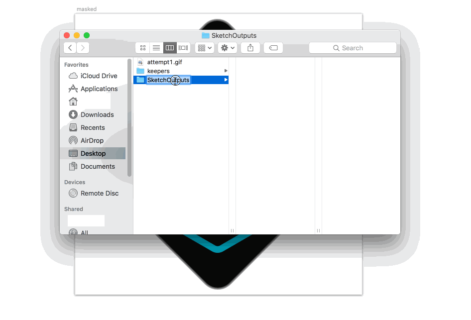

# Mergd Sketch Plugin

This is in alpha development. Please do not use on production systems.

Currently, this plugin, when called on a selected layer or group in Sketch,
outputs the image as SVG, JPG, and PNG at 1x, 2x, and 3x scale to a directory
on the user's desktop.

## Icon Creation and Related Licenses

Original Git icon was modified from
[the original git logo](https://git-scm.com/downloads/logos). Original license
on the logo was as follows:
>Git Logo by Jason Long is licensed under the Creative Commons Attribution 3.0
>Unported License.
>This license lets others distribute, remix, tweak, and build upon your work,
>even commercially, as long as they credit you for the original creation. This
>is the most accommodating of the CC licenses offered. Recommended for maximum
>dissemination and use of licensed materials.
